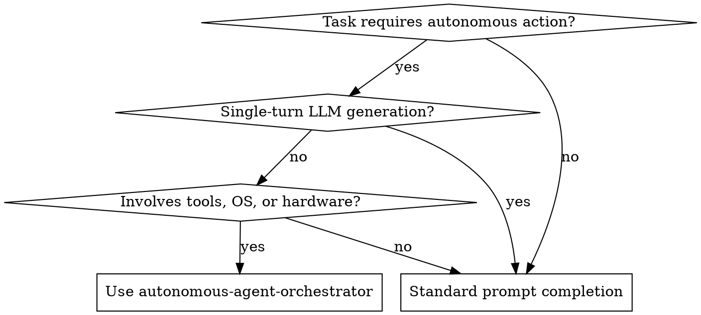

# Autonomous Agent Orchestrator

## Overview

An **Autonomous Agent Orchestrator** connects a reasoning brain, a multi-tiered multimodal memory system, and programmable software/hardware tools into a deterministic, closed-loop execution lifecycle. It ensures agents can perceive multimodal state (voice, vision, metrics), plan resilient multi-step workflows, execute operations across OS and hardware boundaries, and self-correct on failure.

```
       ┌────────────────────────────────────────────────────────┐
       │                  MULTIMODAL SENSORS                    │
       │     (Audio / Vision / Network / Device Telemetry)      │
       └──────────────────────────┬─────────────────────────────┘
                                  │ Sensory Ingestion
                                  ▼
 ┌─────────────────────────────────────────────────────────────────────┐
 │                       MULTIMODAL MEMORY                             │
 │  ┌─────────────────────┐ ┌───────────────────┐ ┌──────────────────┐ │
 │  │ CAG (Context Cache) │ │ RAG (Vector/Doc)  │ │ MAG (Facts/Pref) │ │
 │  │ Fast Token/Hash DB  │ │ Semantic Chunks   │ │ Long-Term Graph  │ │
 │  └─────────────────────┘ └───────────────────┘ └──────────────────┘ │
 └────────────────────────────────┬────────────────────────────────────┘
                                  │ Context Augmented Prompt
                                  ▼
 ┌─────────────────────────────────────────────────────────────────────┐
 │                       ORCHESTRATION BRAIN                           │
 │     [Perception] ➔ [Plan / Decompose] ➔ [Select Tool & Verify]      │
 └──────────────────────────┬──────────────────────────────────────────┘
                            │ Structured Action Dispatch
                            ▼
 ┌─────────────────────────────────────────────────────────────────────┐
 │                    PROGRAMMABLE SYSTEM TOOLS                        │
 │  ┌───────────────────────┐ ┌──────────────────────────────────────┐ │
 │  │   Software Services   │ │        Hardware & OS Native          │ │
 │  │ (REST, WS, Databases) │ │ (Shell, GPIO, Torch, Audio, Devices) │ │
 │  └───────────────────────┘ └──────────────────────────────────────┘ │
 └──────────────────────────┬──────────────────────────────────────────┘
                            │ Observation / Feedback Loop
                            └───────────────┘
```

---

## When to Use



### Apply When:
- Agents must coordinate multi-step goals across local OS commands, web APIs, and device hardware (e.g., Bluetooth, camera, sensors).
- Retaining and recalling multimodal state across interactions (audio transcripts, image frames, persistent user preferences).
- Handling hardware unpredictability (timeouts, offline states, sensor jitter) with deterministic fallback policies.
- Orchestrating tasks requiring iterative tool execution, observation feedback, and self-correction.

### Do NOT Apply When:
- Performing simple single-turn question-answering with no external side effects.
- Running deterministic shell scripts that need no dynamic reasoning or perception.

---

## Core Architecture Principles

### 1. Tri-Tier Memory Hierarchy
Never dump raw history into LLM context. Segregate memory into three distinct access latencies:
- **CAG (Context-Aware Generator / Fast Cache)**: In-memory SHA-256 token/intent cache for immediate deterministic deduplication and sub-10ms query responses.
- **RAG (Retrieval-Augmented Generation / Semantic Memory)**: Vector/hybrid SQLite embeddings for searching unstructured knowledge, documentation, and past episodic transcripts.
- **MAG (Memory-Augmented Graph / Fact Store)**: Relational or graph-based key-value facts, user preferences, and hardware capability constraints.

### 2. Guarded Action Dispatch (Circuit Breakers)
Hardware and OS actions have real-world side effects. All tool dispatches MUST enforce:
- **Schema Validation**: Strict typing (e.g., Pydantic) before executing any command.
- **Permission & Safety Checks**: Restrict destructive actions (system wipe, volume spikes, unauthorized calls).
- **Timeout & Retry Limits**: Maximum 3 retries with exponential backoff; fallback to safe defaults if hardware is unresponsive.

### 3. Closed-Loop Observation & Verification
Never assume tool execution succeeded. The orchestrator must:
1. Dispatch action `A`.
2. Inspect return code, sensor telemetry, or UI state `O`.
3. Feed `O` back into the brain to evaluate: *Was the goal achieved?*
4. If failed, synthesize error diagnostics and attempt alternate plan.

---

## Reference Implementation

```python
"""
Autonomous Agent Orchestrator Pattern
Combines Brain, Multimodal Memory, and Tool Execution Gateway.
"""

import hashlib
import json
import logging
from dataclasses import dataclass, field
from typing import Any, Callable, Dict, List, Optional

logger = logging.getLogger("AutonomousOrchestrator")

# ---------------------------------------------------------
# 1. Multi-Tiered Memory Engine
# ---------------------------------------------------------
@dataclass
class MultimodalMemory:
    cag_cache: Dict[str, str] = field(default_factory=dict)       # Fast Hash Cache
    rag_store: List[Dict[str, Any]] = field(default_factory=list) # Semantic/Episodic
    mag_facts: Dict[str, Any] = field(default_factory=dict)       # User & Hardware Facts

    def query_cag(self, prompt: str) -> Optional[str]:
        prompt_hash = hashlib.sha256(prompt.strip().lower().encode()).hexdigest()
        return self.cag_cache.get(prompt_hash)

    def store_cag(self, prompt: str, response: str) -> None:
        prompt_hash = hashlib.sha256(prompt.strip().lower().encode()).hexdigest()
        self.cag_cache[prompt_hash] = response

    def retrieve_context(self, query: str) -> Dict[str, Any]:
        # Synthesize relevant facts and episodic chunks
        relevant_rag = [doc["content"] for doc in self.rag_store if any(w in doc["content"].lower() for w in query.lower().split())]
        return {
            "facts": self.mag_facts,
            "relevant_knowledge": relevant_rag[:3]
        }

# ---------------------------------------------------------
# 2. Programmable System Tools Gateway
# ---------------------------------------------------------
class ToolGateway:
    def __init__(self):
        self._registry: Dict[str, Callable[..., Dict[str, Any]]] = {}

    def register(self, name: str, func: Callable[..., Dict[str, Any]]):
        self._registry[name] = func

    def execute(self, tool_name: str, **kwargs) -> Dict[str, Any]:
        if tool_name not in self._registry:
            return {"success": False, "error": f"Tool '{tool_name}' not registered"}
        try:
            result = self._registry[tool_name](**kwargs)
            return {"success": True, "result": result}
        except Exception as e:
            logger.error(f"Execution error on {tool_name}: {e}")
            return {"success": False, "error": str(e)}

# ---------------------------------------------------------
# 3. Autonomous Orchestrator Loop
# ---------------------------------------------------------
class OrchestratorBrain:
    def __init__(self, memory: MultimodalMemory, tools: ToolGateway):
        self.memory = memory
        self.tools = tools

    def process_request(self, user_intent: str, sensory_data: Optional[Dict[str, Any]] = None) -> Dict[str, Any]:
        # Step 1: Check Fast CAG Cache
        cached = self.memory.query_cag(user_intent)
        if cached:
            return {"response": cached, "cached": True}

        # Step 2: Assemble Multimodal Context
        context = self.memory.retrieve_context(user_intent)
        context["sensory"] = sensory_data or {}

        # Step 3: Plan & Resolve Action
        plan = self._plan_and_decompose(user_intent, context)

        # Step 4: Execute with Closed-Loop Verification
        execution_results = []
        for step in plan.get("steps", []):
            tool_name = step.get("tool")
            args = step.get("args", {})
            outcome = self.tools.execute(tool_name, **args)
            execution_results.append({"step": step, "outcome": outcome})

            if not outcome.get("success"):
                # Dynamic Self-Correction Fallback
                recovery = self._attempt_recovery(step, outcome, context)
                execution_results.append({"recovery": recovery})
                if not recovery.get("success"):
                    break

        final_response = self._synthesize_final_output(user_intent, execution_results)
        self.memory.store_cag(user_intent, final_response)
        return {"response": final_response, "execution": execution_results}

    def _plan_and_decompose(self, intent: str, context: Dict[str, Any]) -> Dict[str, Any]:
        # Deterministic or LLM-driven action planner
        return {"steps": [{"tool": "system_controller", "args": {"action": intent}}]}

    def _attempt_recovery(self, step: Dict[str, Any], failure: Dict[str, Any], context: Dict[str, Any]) -> Dict[str, Any]:
        logger.warning(f"Attempting recovery for step: {step} due to {failure}")
        return {"success": False, "fallback_applied": "safe_default_state"}

    def _synthesize_final_output(self, intent: str, results: List[Dict[str, Any]]) -> str:
        return f"Executed workflow for '{intent}' with {len(results)} actions."
```

---

## Quick Reference

| Component | Responsibility | Latency / Scope | Fallback / Guardrail |
| :--- | :--- | :--- | :--- |
| **CAG Tier** | SHA-256 prompt hash / token cache | `< 10ms` (In-Memory) | Misses fall through to RAG/Brain |
| **RAG Tier** | Semantic doc search & conversation history | `50 - 200ms` (SQLite/Vector) | Truncate chunks to token budget |
| **MAG Tier** | Persistent user facts, device IDs, preferences | `< 20ms` (Relational Key-Value) | Default system capabilities |
| **Tool Gateway** | Native OS commands, hardware actuators, APIs | Variable (`10ms - 5s`) | Circuit breaker + 3x retry limit |
| **Self-Correction**| Analyzes return codes & error states | Brain loop cycle | Revert side-effects to safe state |

---

## Common Mistakes & Red Flags

| Excuse / Anti-Pattern | Reality & Fix |
| :--- | :--- |
| **"Dump all sensor telemetry directly into context"** | Consumes context rapidly and creates hallucination noise. Filter and summarize telemetry into structured state flags before prompting. |
| **"Fire-and-forget hardware commands"** | Hardware fails silently (dead batteries, dropped sockets, permission revocation). Always verify post-execution state. |
| **"Unrestricted shell/hardware execution"** | High risk of system bricking or infinite loops. Enforce a strict whitelist schema for all tool parameters. |
| **"Bypassing memory for raw queries"** | Results in repetitive tool invocations and slow responses. Check CAG/MAG first for deterministic actions. |

### Red Flags — STOP and Re-evaluate
- Triggering physical hardware actions without pre-flight permission/capability verification.
- Infinite execution loops when a hardware tool repeatedly returns an error.
- Storing transient, noisy sensor data in long-term MAG facts instead of ephemeral CAG context.
