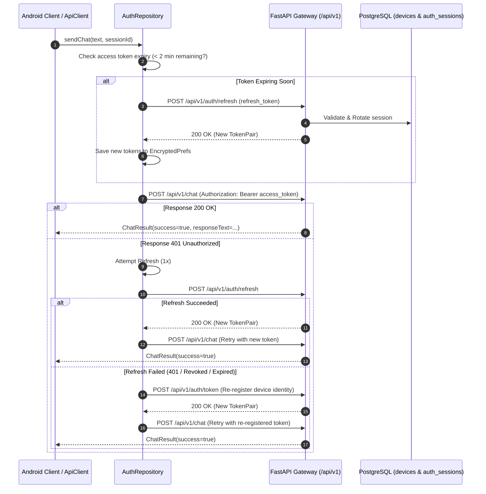

# JARVIS AI — AUTHENTICATION & RECOVERY ARCHITECTURE

> **Subsystem:** Token Management, 401 Recovery, Session Rotation, and Device Identity  

---

## 1. Automated 401 Recovery & Refresh Flow



---

## 2. Database Schema (PostgreSQL)

```sql
-- Devices Table (Persistent Device Identity)
CREATE TABLE IF NOT EXISTS devices (
    id SERIAL PRIMARY KEY,
    device_id VARCHAR(64) UNIQUE NOT NULL,
    device_name VARCHAR(128) NOT NULL,
    device_model VARCHAR(128) NOT NULL,
    os_version VARCHAR(64) NOT NULL,
    trusted BOOLEAN DEFAULT FALSE,
    created_at TIMESTAMP WITH TIME ZONE DEFAULT NOW(),
    updated_at TIMESTAMP WITH TIME ZONE DEFAULT NOW(),
    last_seen_at TIMESTAMP WITH TIME ZONE DEFAULT NOW(),
    revoked_at TIMESTAMP WITH TIME ZONE NULL,
    metadata JSONB DEFAULT '{}'::jsonb
);

-- Auth Sessions Table (Hashed Refresh Token Tracking & Rotation)
CREATE TABLE IF NOT EXISTS auth_sessions (
    id SERIAL PRIMARY KEY,
    session_id VARCHAR(64) UNIQUE NOT NULL,
    device_id VARCHAR(64) REFERENCES devices(device_id) ON DELETE CASCADE,
    refresh_token_hash VARCHAR(64) NOT NULL,
    created_at TIMESTAMP WITH TIME ZONE DEFAULT NOW(),
    expires_at TIMESTAMP WITH TIME ZONE NOT NULL,
    last_used_at TIMESTAMP WITH TIME ZONE DEFAULT NOW(),
    revoked_at TIMESTAMP WITH TIME ZONE NULL,
    device_metadata JSONB DEFAULT '{}'::jsonb
);

CREATE INDEX IF NOT EXISTS idx_devices_device_id ON devices(device_id);
CREATE INDEX IF NOT EXISTS idx_auth_sessions_hash ON auth_sessions(refresh_token_hash);
```
