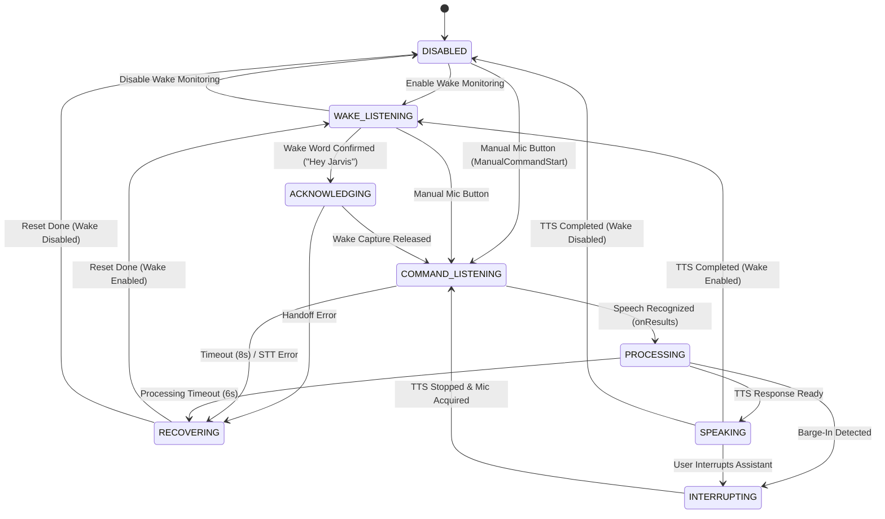
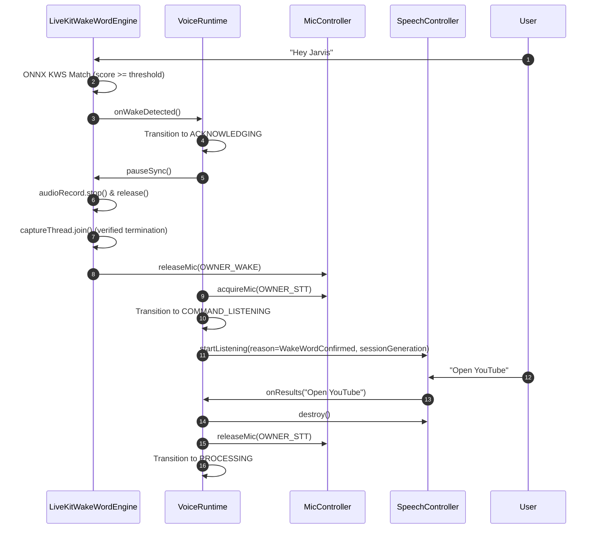

# JARVIS AI — VOICE & ACOUSTIC ENGINE ARCHITECTURE

> **Subsystem:** On-Device Speech Pipeline, State Machine & Microphone Ownership  

---

## 1. Canonical Voice State Machine

---

## 2. Atomic Microphone Ownership Matrix

| Ownership State | Active Component | Recording Hardware | Audio Source | Restrictions |
|---|---|---|---|---|
| `NONE` | None | Released (`AudioRecord == null`) | — | Microphone completely free |
| `WAKE_WORD` | `LiveKitWakeWordEngine` | `AudioRecord` (16kHz Mono 16-bit PCM) | `VOICE_RECOGNITION` | Continuous ONNX inference; must release before STT |
| `COMMAND_STT` | `SpeechController` | Native Android `SpeechRecognizer` | Platform Managed | Exclusively owns audio session until utterance complete |
| `INTERRUPT` | `InterruptDetector` | Lightweight RMS Audio Stream | `VOICE_RECOGNITION` | Active ONLY during `SPEAKING` state |

---

## 3. Strict Wake → Command Handoff Sequence

