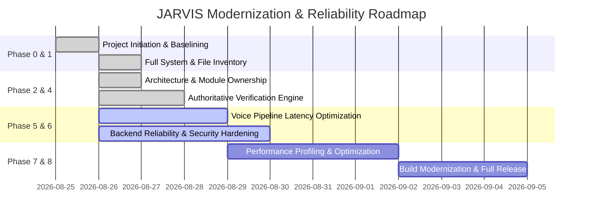

# JARVIS / AND9 — Modernization Roadmap

```mermaid
gantt
    title JARVIS Modernization & Reliability Roadmap
    dateFormat  YYYY-MM-DD
    section Phase 0 & 1
    Project Initiation & Baselining        :done, p0, 2026-08-25, 2026-08-26
    Full System & File Inventory          :done, p1, 2026-08-26, 2026-08-27
    section Phase 2 & 4
    Architecture & Module Ownership       :done, p2, 2026-08-26, 2026-08-27
    Authoritative Verification Engine     :done, p4, 2026-08-26, 2026-08-28
    section Phase 5 & 6
    Voice Pipeline Latency Optimization   :active, p5, 2026-08-26, 2026-08-29
    Backend Reliability & Security Hardening:active, p6, 2026-08-26, 2026-08-30
    section Phase 7 & 8
    Performance Profiling & Optimization  :p7, 2026-08-29, 2026-09-02
    Build Modernization & Full Release    :p8, 2026-09-02, 2026-09-05
```
